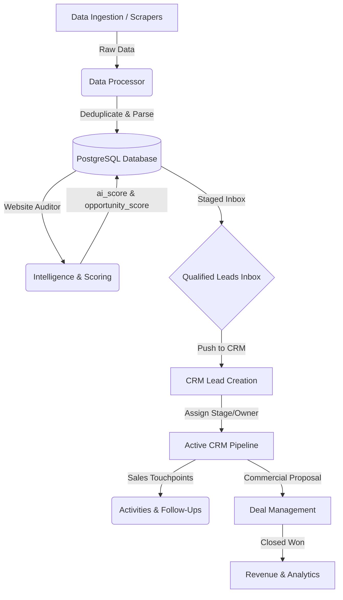

# BizRank CRM System Architecture

This document describes the high-level architecture of the BizRank CRM module and how it integrates with the existing business discovery/intelligence platform.

## 1. System Topology & Data Flow

BizRank acts as an opportunity identification funnel, transforming raw scraper data into active sales deals. The diagram below represents the system hierarchy from sourcing to revenue close:

---

## 2. Decoupled Funnel Strategy

To ensure provider-agnostic scalability, the CRM system separates the **sourcing data** (what is scraped) from the **sales operations data** (how we sell):

1. **Business Intelligence Layer**: Represents physical establishments collected from Google Places, Apify, or mock sources. This data is static and reusable.
2. **Sales/CRM Layer**: Represents business-development interactions, pipeline progression, and financial contracts.

By decoupling `Business` from `CRMLead`, the system achieves:
- **No Sourcing Dependency**: Discovery jobs can overwrite or update business details without losing sales histories, notes, or deal stages.
- **Relational Cleanliness**: Business locations are normalized to standard country/state/city tables while sales operations follow a standard lead/deal relationship.

---

## 3. CRM Architectural Integration Points

The CRM module integrates into the existing Next.js App Router setup at three primary levels:

### A. Sourcing Ingestion Point (`app/api/jobs/[id]/route.ts`)
When a scraping job finishes, data is written to the `Business` table with `discovery_status = 'Discovered'`.
The CRM does not touch this flow. The business discovery system runs completely independently.

### B. Qualification Staging Point (`app/leads/LeadsClient.tsx` & `/api/businesses/[id]`)
Businesses marked as `Qualified` land in the "Inbox Staging Area."
- When "Push to CRM" is clicked:
  1. A `CRMLead` record is created in the database.
  2. The `Business.discovery_status` is updated to `'CRM'`.
  3. The initial pipeline stage is set to `'New'`.
  4. An `AuditLog` entry is created.

### C. Pipeline Board (`app/crm/`)
An interactive drag-and-drop Kanban board allows moving leads between stages. Moving a card triggers a PATCH to `/api/crm/leads/[id]` to update the stage and logs an audit trail event.

---

## 4. Frontend Component Layout

The CRM interface uses the established styling tokens (vanilla CSS + glassmorphism themes) and follows Next.js App Router conventions:

- `/crm` - Dashboard (Key Sales KPIs & Conversion Metrics)
- `/crm/leads` - List of active leads with search, tags, and status filtering
- `/crm/leads/[id]` - Lead Detail Page (Split layout: Left = Business profile, Center = Activity timeline & notes, Right = Tasks/Follow-ups/Deal info)
- `/crm/pipeline` - Drag-and-drop Sales Pipeline Kanban Board
- `/crm/follow-ups` - Calendar/List view of pending call/email reminders

---

## 5. Security & Permission Strategy

Authorization middleware will inspect active user roles:
- `ADMIN`: Full configuration access, deletion privileges, custom pipeline stage editing.
- `MANAGER`: Reassign leads, view aggregated sales dashboard, modify deal values.
- `SALES_AGENT`: Manage assigned leads, log activities, schedule follow-ups.
- `VIEWER`: Read-only access to pipeline and business data.
