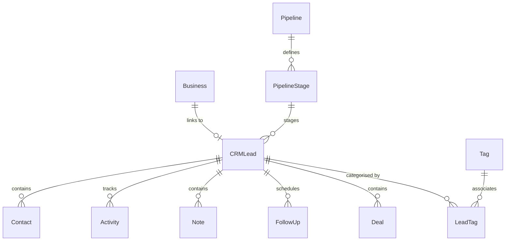

# BizRank CRM Database Schema Design

This document details the database models, relations, indexes, and unique constraints for the proposed CRM module. All models are defined using Prisma ORM syntax and normalise operations to prevent data duplication.

## 1. Relational Entity Relationship Diagram (ERD)



---

## 2. Proposed Prisma Schema Definitions

### A. Core Sales Lead Model (`CRMLead`)
The central sales opportunity node representing a sales process with a business.
```prisma
model CRMLead {
  id                Int             @id @default(autoincrement())
  businessId        Int             @unique
  business          Business        @relation(fields: [businessId], references: [id], onDelete: Cascade)
  
  pipelineStageId   Int
  pipelineStage     PipelineStage   @relation(fields: [pipelineStageId], references: [id])
  
  priority          String?         // 'A', 'B', 'C'
  leadScore         Int             @default(0)
  estimatedValue    Float           @default(0.0)
  assignedTo        String?         // Assigned agent identifier (Username/Email)
  
  createdAt         DateTime        @default(now())
  updatedAt         DateTime        @updatedAt

  // CRM Child Relations
  contacts          Contact[]
  activities        Activity[]
  notes             CRMNote[]
  followUps         FollowUp[]
  deals             Deal[]
  tags              LeadTag[]

  @@index([pipelineStageId])
  @@index([assignedTo])
  @@index([priority])
}
```

### B. Contact Model (`Contact`)
Supports mapping multiple individuals at a business (e.g. CEO, Sales Director, Secretary).
```prisma
model Contact {
  id                     Int       @id @default(autoincrement())
  crmLeadId              Int
  crmLead                CRMLead   @relation(fields: [crmLeadId], references: [id], onDelete: Cascade)
  
  name                   String
  role                   String?   // 'Owner', 'Manager', 'IT Administrator', etc.
  phone                  String?
  email                  String?
  whatsapp               String?
  preferredContactMethod String?   // 'EMAIL', 'PHONE', 'WHATSAPP'
  isPrimary              Boolean   @default(false)
  
  createdAt              DateTime  @default(now())
  updatedAt              DateTime  @updatedAt

  @@index([crmLeadId])
}
```

### C. Pipeline & Stages Configuration
Dynamic database-driven columns rather than hardcoded client components.
```prisma
model Pipeline {
  id          Int             @id @default(autoincrement())
  name        String          @unique
  stages      PipelineStage[]
  createdAt   DateTime        @default(now())
}

model PipelineStage {
  id          Int        @id @default(autoincrement())
  name        String     @unique // 'NEW', 'CONTACTED', 'MEETING_SCHEDULED', 'PROPOSAL_SENT', 'WON', 'LOST'
  order       Int        // Column display order (1, 2, 3...)
  pipelineId  Int
  pipeline    Pipeline   @relation(fields: [pipelineId], references: [id])
  leads       CRMLead[]
  
  createdAt   DateTime   @default(now())

  @@index([pipelineId])
  @@index([order])
}
```

### D. Activity Model (`Activity`)
Granular tracking of client interaction touchpoints.
```prisma
enum ActivityType {
  CALL
  WHATSAPP
  EMAIL
  MEETING
  DEMO
  PROPOSAL
  OTHER
}

model Activity {
  id          Int          @id @default(autoincrement())
  crmLeadId   Int
  crmLead     CRMLead      @relation(fields: [crmLeadId], references: [id], onDelete: Cascade)
  
  type        ActivityType
  outcome     String?      // 'Connected', 'No Answer', 'Busy', etc.
  summary     String       // Brief title
  details     String?      // Full description block
  performedBy String       // Agent name/identifier
  occurredAt  DateTime     @default(now())
  
  createdAt   DateTime     @default(now())
  updatedAt   DateTime     @updatedAt

  @@index([crmLeadId])
  @@index([type])
  @@index([occurredAt])
}
```

### E. Note Model (`CRMNote`)
Separate from timeline activity logs, notes store long-term business rules and profile insights.
```prisma
model CRMNote {
  id          Int      @id @default(autoincrement())
  crmLeadId   Int
  crmLead     CRMLead  @relation(fields: [crmLeadId], references: [id], onDelete: Cascade)
  
  author      String
  content     String   // Long-term guidelines (e.g. "Do not call before 2 PM")
  
  createdAt   DateTime @default(now())
  updatedAt   DateTime @updatedAt

  @@index([crmLeadId])
}
```

### F. Follow-Up Model (`FollowUp`)
Schedules future sales triggers (reminders/calls). Statuses are derived in queries.
```prisma
enum FollowUpStatus {
  PENDING
  COMPLETED
  CANCELLED
}

model FollowUp {
  id          Int            @id @default(autoincrement())
  crmLeadId   Int
  crmLead     CRMLead        @relation(fields: [crmLeadId], references: [id], onDelete: Cascade)
  
  assignedTo  String
  dueAt       DateTime
  status      FollowUpStatus @default(PENDING)
  completedAt DateTime?
  outcome     String?
  
  createdAt   DateTime       @default(now())
  updatedAt   DateTime       @updatedAt

  @@index([crmLeadId])
  @@index([status])
  @@index([dueAt])
}
```

### G. Commercial Deal Model (`Deal`)
Tracks commercial transactions. Leads can have multiple deals over time.
```prisma
enum DealStatus {
  OPEN
  WON
  LOST
}

model Deal {
  id                Int        @id @default(autoincrement())
  crmLeadId         Int
  crmLead           CRMLead    @relation(fields: [crmLeadId], references: [id], onDelete: Cascade)
  
  value             Float      @default(0.0)
  currency          String     @default("USD")
  expectedCloseDate DateTime?
  status            DealStatus @default(OPEN)
  wonAt             DateTime?
  lostReason        String?
  
  createdAt         DateTime   @default(now())
  updatedAt         DateTime   @updatedAt

  @@index([crmLeadId])
  @@index([status])
}
```

### H. Tagging System (`Tag`, `LeadTag`)
Normalized structures allowing tagging leads with customizable parameters.
```prisma
model Tag {
  id        Int       @id @default(autoincrement())
  name      String    @unique // 'HOT', 'WEBSITE_UPGRADE', 'URGENT'
  leads     LeadTag[]
  createdAt DateTime  @default(now())
}

model LeadTag {
  crmLeadId Int
  crmLead   CRMLead @relation(fields: [crmLeadId], references: [id], onDelete: Cascade)
  tagId     Int
  tag       Tag     @relation(fields: [tagId], references: [id], onDelete: Cascade)

  @@id([crmLeadId, tagId])
}
```

### I. CRM Audit Logging (`CRMAuditLog`)
Maintains an immutable historical record of key transactions.
```prisma
model CRMAuditLog {
  id            Int      @id @default(autoincrement())
  performedBy   String   // User username or agent email
  action        String   // 'LEAD_CREATED', 'STAGE_CHANGED', 'DEAL_WON', etc.
  entityType    String   // 'CRMLead', 'Deal', 'Activity'
  entityId      Int
  previousValue String?  // Stringified state or value
  newValue      String?
  createdAt     DateTime @default(now())

  @@index([entityType, entityId])
  @@index([createdAt])
}
```

---

## 3. Database Migration Strategy

To avoid breaking existing data and retain complete backward compatibility:
1. **Additive Updates**: Keep the existing `Business` model completely untouched.
2. **Nullable Reference**: Keep the relationship from `Business` to `CRMLead` optional.
3. **Seed Clean-up Task**: Populate the initial `Pipeline` and `PipelineStage` records.
4. **Data Sync Job**: Backport any businesses with a legacy `crm_status` set (e.g. `'Lead'`, `'Contacted'`) by creating corresponding `CRMLead` and `Deal` objects.
