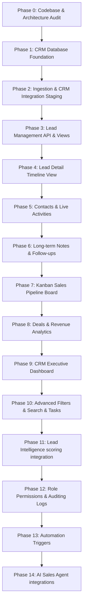

# BizRank CRM Module Implementation Plan

This implementation roadmap outlines a phase-by-phase execution strategy to introduce a robust CRM system into BizRank.

---

## 1. Dependency Graph & Development Flow

---

## 2. Phase-by-Phase Execution Roadmap

### Phase 1: CRM Database Foundation
- **Goal**: Provision CRM tables and establish core model relationships.
- **Database changes**: Create `CRMLead`, `Pipeline`, `PipelineStage`, `Contact`, `Activity`, `CRMNote`, `FollowUp`, `Deal`, `Tag`, `LeadTag`, `CRMAuditLog` tables in `schema.prisma`.
- **API endpoints**: None.
- **Components**: None.
- **Migration requirement**: Run `npx prisma db push` to safely create tables in Neon database. Legacy tables are unmodified.
- **Dependencies**: Phase 0.
- **Risks**: Schema mapping inconsistencies. Prevented by testing connection using dummy Prisma clients.
- **Acceptance criteria**: Tables exist in Neon DB and Prisma client type compiles successfully.

---

### Phase 2: Discovery → CRM Integration
- **Goal**: Enable promotion of a discovered business to the active sales CRM.
- **Database changes**: None.
- **Backend changes**: Extend `/api/businesses/[id]` PATCH endpoint to trigger the transition.
- **API endpoints**: `POST /api/crm/leads`.
- **Components**: Update `LeadsClient.tsx` "Push to CRM" handler to post to the new endpoint.
- **Tests**: Verify that clicking "Push" successfully creates a `CRMLead` record and marks `Business.discovery_status` as `'CRM'`.
- **Acceptance criteria**: Handshakes between Discovery queue and CRM staging are fully automated.

---

### Phase 3: Leads Management
- **Goal**: Create the list view of active sales leads.
- **Database changes**: None.
- **API endpoints**: `GET /api/crm/leads`.
- **Components**: Build `app/crm/leads/page.tsx` and `app/crm/leads/LeadsClient.tsx`.
- **Tests**: Mock lead data queries with sorting by created date.
- **Acceptance criteria**: Leads list loads successfully using standard Next.js table templates.

---

### Phase 4: Lead Detail View
- **Goal**: Build the main sales intelligence cockpit page.
- **Database changes**: None.
- **API endpoints**: `GET /api/crm/leads/[id]`.
- **Components**: Create `/app/crm/leads/[id]/page.tsx` and `LeadDetailClient.tsx`.
- **Tests**: Verify page handles non-existent or invalid lead IDs gracefully (returns HTTP 404).
- **Acceptance criteria**: Detail page retrieves and renders business profile information correctly.

---

### Phase 5: Contacts & Activities
- **Goal**: Track interaction touchpoints and list team contacts.
- **Database changes**: None.
- **API endpoints**: `POST /api/crm/leads/[id]/contacts`, `GET/POST /api/crm/leads/[id]/activities`.
- **Components**: Add Contact list drawer and Activity log form to Lead Detail page.
- **Tests**: Verify that saving a call activity updates the client timeline automatically.
- **Acceptance criteria**: Logged calls, emails, and WhatsApp actions render on the timeline in chronological order.

---

### Phase 6: Notes & Follow-Ups
- **Goal**: Configure client directives and schedule future call reminders.
- **Database changes**: None.
- **API endpoints**: `GET/POST /api/crm/leads/[id]/notes`, `POST /api/crm/leads/[id]/follow-ups`, `PATCH /api/crm/follow-ups/[id]`.
- **Components**: Notes text card editor and Follow-ups task board widget.
- **Tests**: Verify that follow-ups past their due time automatically flag as "Overdue".
- **Acceptance criteria**: Sales reps can configure reminders that are displayed on the Lead Detail page.

---

### Phase 7: Pipeline Kanban Board
- **Goal**: Interactive deal staging drag-and-drop dashboard.
- **Database changes**: Add default seeds for `PipelineStage`.
- **API endpoints**: `PATCH /api/crm/leads/[id]` (stage updates).
- **Components**: Implement a responsive board using `@dnd-kit/core` at `/app/crm/pipeline/`.
- **Tests**: Verify drag-and-drop operations persist changes to the database on drop.
- **Acceptance criteria**: Legacy `/pipeline` and `/crm` boards are consolidated under the new DB-driven stages.

---

### Phase 8: Deals & Revenue Analytics
- **Goal**: Lead monetization and closing triggers.
- **Database changes**: None.
- **API endpoints**: `POST/PATCH /api/crm/leads/[id]/deals`.
- **Components**: Add Deal conversion dialog to Lead Detail screen.
- **Tests**: Verify that marking a deal as WON instantly flags the Lead stage as WON and locks the deal values.
- **Acceptance criteria**: Value variables are strictly type-safe floats. No mocks or dummy values allowed.

---

### Phase 9: CRM Dashboard
- **Goal**: Provide an executive summary of pipeline metrics.
- **Database changes**: Add indexes to `Deal.status` and `CRMLead.pipelineStageId`.
- **API endpoints**: `GET /api/crm/dashboard`.
- **Components**: Build active KPI widgets (Conversion, Revenue, Win-Loss rates, Overdue counts).
- **Tests**: Verify aggregated revenue totals equal the sum of WON deals.
- **Acceptance criteria**: Dashboard displays accurate sales numbers pulled in real-time from the database.

---

### Phase 10: Search, Filters, Tags & Tasks
- **Goal**: Refine list exploration and tag classification.
- **Database changes**: Create tag models and link them to leads.
- **API endpoints**: Query parameter additions to `/api/crm/leads`.
- **Components**: Multi-select filter panel in Leads page.
- **Tests**: Verify searching by business name returns matching records.
- **Acceptance criteria**: Reps can tag leads (e.g. `'HOT'`) and filter the list accordingly.

---

### Phase 11: Lead Intelligence Scoring
- **Goal**: Integrate lead rating rules without rebuilding the scoring engine.
- **Database changes**: None.
- **Backend changes**: Expose `ai_score` and `opportunity_score` properties to the CRM Lead model directly.
- **Acceptance criteria**: Leads display opportunity rating flags based on the existing scoring system.

---

### Phase 12: Role Permissions & Auditing
- **Goal**: Secure sales transactions and log modifications.
- **Database changes**: None.
- **API endpoints**: Connect audit logs to `/api/crm/leads/[id]/audit`.
- **Components**: Read-only timeline audits at the bottom of the Detail page.
- **Tests**: Verify stage modifications write record details to the `CRMAuditLog` table.
- **Acceptance criteria**: All high-importance operations (deal closes, deletions) write transaction logs.

---

### Phase 13: Automation Triggers
- **Goal**: Event-driven notification workflows.
- **Backend changes**: Fire email notifications when a deal transitions to "WON" or "LOST".
- **Acceptance criteria**: Automated alerts are sent for stage transitions.

---

### Phase 14: AI Sales Agent
- **Goal**: Introduce automated outreach recommendations.
- **Backend changes**: Integrate OpenAI APIs to read website audit results and suggest draft emails for cold leads.
- **Acceptance criteria**: Suggest button generates personalized drafts based on website audit gaps.

---

## 3. General Testing & Verification Strategy

After completing each phase, run the following verification checks:
1. **Compilation**: Run `npm run build` or `npx tsc` to verify zero TypeScript errors.
2. **Linting**: Run `npx eslint .` to ensure code styling compliance.
3. **Database Checks**: Run `npx prisma db push` to verify no schema regression or column truncation occurs.
4. **API Integration**: Test using local script files in `scratch/` to verify HTTP responses and schemas.
